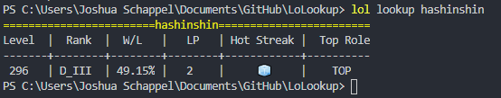

# LoLookup
A fast, lightweight command line application for looking up League of Legends account information and in game opponents.
LoLookup takes a minimalist approach by only showing you the most relevant information.


### Features
- Account Statistics
- Game information
- Recent game history

### Commands
- lookup <username>
- game <username>
- history <username>

### Installation
1) Download the lol.exe file.
2) Save it to a folder named Lolookup on your computer
3) Add the path the Lolookup folder as a env variable on your computer 
4) Open a cmd prompt and type ```lol help```

### Screenshots
Lookup an accounts current stats:<br/>



Lookup an accounts in game opponents:<br/>


#### Frameworks used:
- [reqwest](https://github.com/seanmonstar/reqwest) for http requests.
- [console](https://github.com/mitsuhiko/console) for cmd text coloring.
- [serde_json](https://github.com/serde-rs/json) for JSON deserializing.
- [tokio](https://github.com/tokio-rs/tokio) for asynchronous runtime environment.
